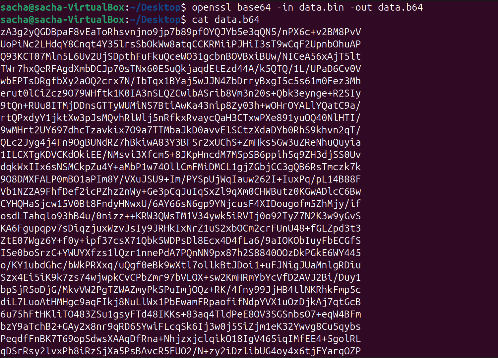
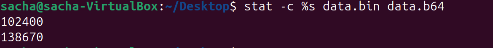
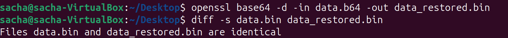
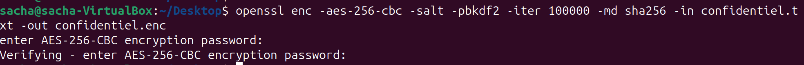
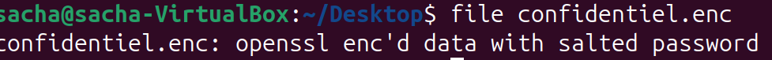
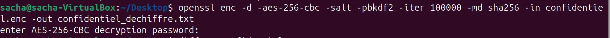
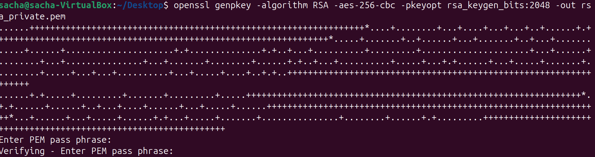
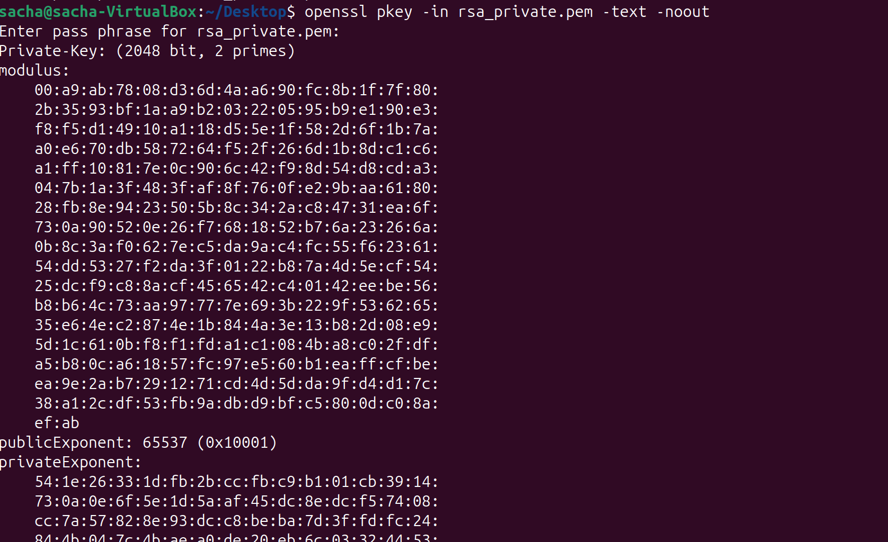
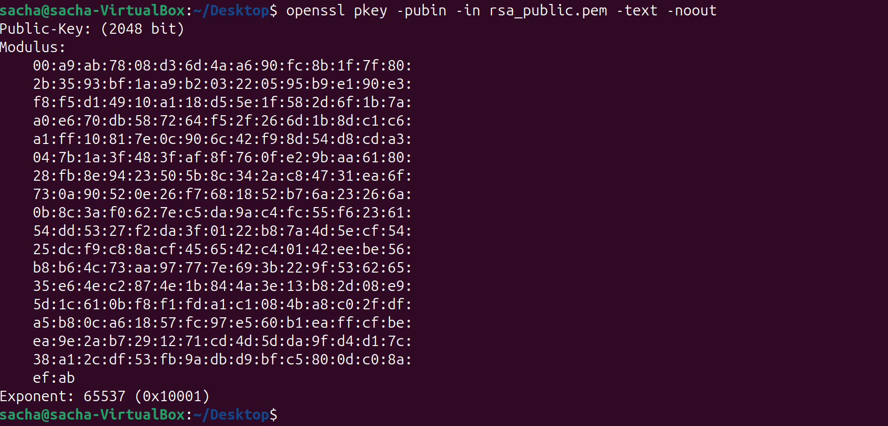
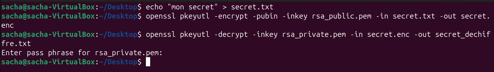

# II. Sans que je vous file les réponses à chaques étapes

## A. Base64

### 1. Génération d’un fichier binaire

- Génération 100 Kio aléatoires
`dd if=/dev/urandom of=data.bin bs=1024 count=100`

- Vérifier la taille :   
`stat -c %s data.bin`

### 2. Encodage 

- Encodage Base64 :    
`openssl base64 -in data.bin -out data.b64`

- Afficher le contenu :     
`cat data.b64`

- Comparer les tailles :
`stat -c %s data.bin data.b64`

 

### 3. Décodage

- Décodage vers un nouveau fichier :  
`openssl base64 -d -in data.b64 -out data_restored.bin`

- Vérifier que les deux binaires sont identiques:
`diff -s data.bin data_restored.bin`

### 4. Questions
- 1. Base64 est-il un chiffrement ? Pourquoi ?

Non, c’est seulement un encodage de représentation, réversible sans secret ni clé, donc pas un chiffrement au sens cryptographique.

- 2. Pourquoi la taille du fichier change-t-elle après encodage ?

Base64 prend 3 octets binaires et les transforme en 4 caractères de 6 bits chacun, soit 4 octets ASCII, d’où un gonflement systématique, plus éventuels caractères de fin de ligne.

- 3. Quel est approximativement le pourcentage d’augmentation ?
 
Base64 augmente la taille d’environ un tiers, donc on dit « à peu près +33% de taille par rapport au fichier d’origine.

- 4. Quelle méthode permet de vérifier rigoureusement que deux fichiers sont identiques ?

Utiliser une comparaison bit à bit (ex. diff, cmp) ou comparer des empreintes cryptographiques fortes.

## B. Chiffrement symétrique – AES

### 1. Création d’un message

- Créer un fichier confidentiel.txt contenant :
`nano confidentiel.txt`

### 2. Chiffrement

- Chiffrer le fichier avec :   
-AES 256  
-Un sel   
-Une dérivation de clé robuste  
-Un algorithme de hachage sécurisé 

`openssl enc -aes-256-cbc -salt -pbkdf2 -iter 100000 -md sha256 -in confidentiel.txt -out confidentiel.enc`

- Vérifier que le fichier est binaire :

`file confidentiel.enc` 

il est bien indiqué data donc le fichier est binaire.

### 3. Déchiffrement

- Déchiffrement :

`openssl enc -d -aes-256-cbc -salt -pbkdf2 -iter 100000 -md sha256 -in confidentiel.enc -out confidentiel_dechiffre.txt`

- Vérifier l’égalité :

`diff -s confidentiel.txt confidentiel_dechiffre.txt`

### 4. Analyse

Quand tu refais le chiffrement du même fichier avec le même mot de passe, tu vas obtenir deux fichiers .enc différents, même s’ils se déchiffrent tous les deux correctement.

### 5. Questions

- Pourquoi les deux fichiers chiffrés sont-ils différents ?

À cause du sel et du vecteur d’initialisation aléatoires, qui modifient la clé dérivée et l’état initial du mode de chiffrement, rendant chaque chiffrement unique même avec le même mot de passe.

- Quel est le rôle du sel ?

Empêcher que deux mots de passe identiques produisent la même clé dérivée et contrer les attaques par tables pré‑calculées (rainbow tables) en salant la dérivation de clé.

- Que se passe-t-il si une option change lors du déchiffrement ?

Le déchiffrement échoue ou produit des données impossibles à interpréter, car la clé ou les paramètres ne correspondent plus à ceux du chiffrement.

- Pourquoi utilise-t-on PBKDF2 ?

PBKDF2 applique un grand nombre d’itérations de hachage pour dériver la clé à partir du mot de passe, ce qui ralentit fortement les attaques par brute‑force ou dictionnaire sur le mot de passe.

- Quelle est la différence entre encodage et chiffrement ?

Encodage : transformation réversible et publique (ex. Base64) pour le transport ou le stockage, sans secret.
Chiffrement : transformation réversible seulement avec une clé secrète, visant la confidentialité des données.

## C. Cryptographie asymétrique – RSA

### 1. Génération de clés

- Générer une paire de clés RSA 2048 bits :

`openssl genpkey -algorithm RSA -pkeyopt rsa_keygen_bits:2048 -aes-256-cbc -pbkdf2 -out rsa_private.pem`

- En extraire la clé publique :

`openssl pkey -in rsa_private.pem -pubout -out rsa_public.pem`

- Afficher les paramètres détaillés de la clé privée :

`openssl pkey -in rsa_private.pem -text -noout`

- Afficher les paramètres de la clé publique :

`openssl pkey -pubin -in rsa_public.pem -text -noout`

- Comparer: 
La clé publique et la clé privée ont le même modulus, mais la clé privée contient en plus l’exposant privé et les facteurs secrets, alors que la clé publique ne contient que le modulus et l’exposant public.

### 2. Chiffrement asymétrique

- Créer le fichier :

`echo "mon secret" > secret.txt`

- Chiffrer avec la clé publique :

`openssl pkeyutl -encrypt -pubin -inkey rsa_public.pem -in secret.txt -out secret.enc`

- Déchiffrer avec la clé privée :

`openssl pkeyutl -decrypt -inkey rsa_private.pem -in secret.enc -out secret_dechiffre.txt`

### 3. Questions

- Pourquoi la clé privée ne doit-elle jamais être partagée ?

Elle permet de déchiffrer tout ce qui a été chiffré avec la clé publique et de signer au nom du propriétaire ; si elle fuit, la confidentialité et l’authenticité sont perdues.

- Pourquoi RSA n’est-il pas adapté au chiffrement de gros fichiers ?

Les opérations RSA sont coûteuses, la taille du message est limitée par la taille de la clé et le padding, et le débit serait très faible ; on préfère chiffrer une petite clé symétrique puis le fichier en symétrique.

- Quelles différences observe-t-on entre les paramètres d’une clé publique et d’une clé privée ?

Clé publique : contient surtout le modulus (le grand nombre commun aux deux clés) et l’exposant public.

Clé privée : contient le même modulus et le même exposant public, mais aussi l’exposant privé ainsi que les deux grands nombres premiers utilisés pour construire la clé et d’autres valeurs dérivées pour accélérer les calculs.

- Quel est le rôle du modulo dans RSA ?

Toutes les opérations RSA se font avec un grand nombre n, qui est le produit de deux grands nombres premiers.

La sécurité vient du fait qu’il est très difficile de retrouver ces deux nombres premiers à partir de n.

- Pourquoi utilise-t-on souvent RSA pour chiffrer une clé AES plutôt qu’un document entier ?

Parce que c’est plus efficace : RSA sert à chiffrer une petite clé de session (AES) et AES chiffre rapidement de gros volumes de données ; c’est le principe du chiffrement hybride