# TP5 : pfSense – Bases d’un pare-feu

## Partie 1 – Prise en main et sécurisation

### 1. Accès à l’interface

- Dans la barre d'adresse, tape précisément : https://192.168.1.1 

#### .Questions
- Quelle est l’adresse IP du LAN ? : 192.168.1.1/24

- Quelle est l’adresse IP du WAN ? : 10.0.2.15/24.

- Pourquoi utilise-t-on HTTPS ? : Pour chiffrer la connexion entre ton navigateur et le pare-feu. Cela empêche un espion sur le réseau de lire tes identifiants de connexion.

- Pourquoi faut-il changer les identifiants par défaut sur un pare-feu ? : Parce que admin / pfsense est une information publique. N'importe qui sur le réseau pourrait prendre le contrôle total du pare-feu et donc de toute ta sécurité s'ils ne sont pas modifiés.

### 2. Sécurisation de l’accès administrateur

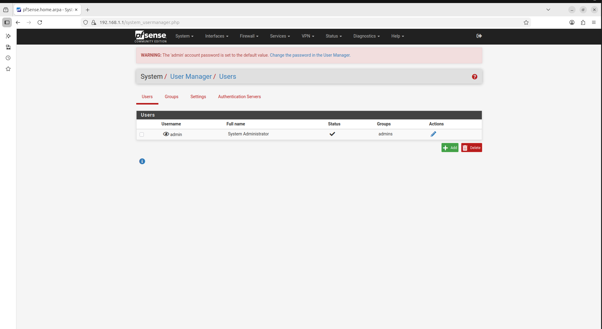

-Allez dans le menu System (en haut à gauche).  
-Sélectionnez User Manager.   
-Cliquez sur l'icône en forme de crayon (Edit) à droite de l'utilisateur admin.  
-Dans le champ Password, tapez votre nouveau mot de passe.  
-Descendez tout en bas de la page et cliquez sur Save.

#### .Questions

- Où se gèrent les utilisateurs ?
Les utilisateurs se gèrent dans le menu System > User Manager.

- Qu’est-ce qu’un mot de passe robuste ?
Un mot de passe robuste est un mot de passe complexe, difficile à deviner ou à casser par "force brute". Il doit idéalement comporter au moins 12 caractères et mélanger des majuscules, des minuscules, des chiffres et des caractères spéciaux. 

- Pourquoi sécuriser en priorité l’accès admin sur un équipement réseau ?
Le compte administrateur possède tous les droits sur le pare-feu. Si un attaquant y accède, il peut désactiver toutes les protections, espionner le trafic réseau, voler des données ou isoler complètement ton réseau LAN d'Internet. C'est la "clé de voûte" de ta sécurité.

## Partie 2 – Comprendre les interfaces réseau

### 3. Vérification des interfaces

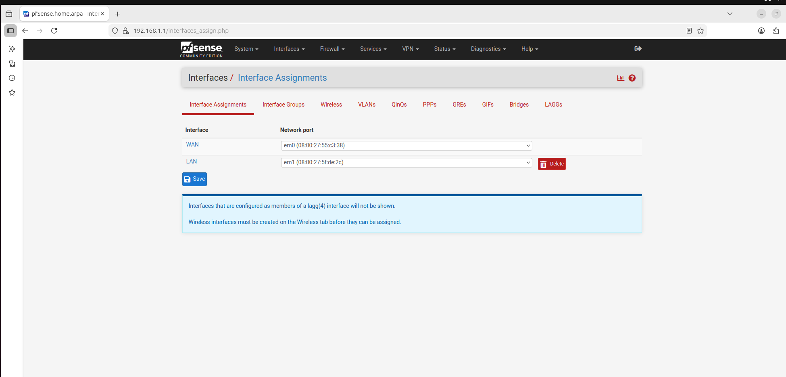

#### .Questions

- Quelle interface permet l’accès Internet ?    
C'est l'interface WAN

- Quelle interface correspond au réseau interne ?   
C'est l'interface LAN

- Que se passerait-il si les interfaces étaient inversées ?   
Le pare-feu ne fonctionnerait pas car il chercherait Internet sur ton réseau local (LAN) et tenterait de protéger ton réseau local via la carte connectée à ta box (WAN). Ton Ubuntu n'aurait plus d'accès à l'interface de gestion car pfSense bloque par défaut les connexions entrantes sur le WAN pour des raisons de sécurité.

## Partie 3 – Configuration des services réseau

### 4. DHCP

#### .Questions 

- Pourquoi DHCP plutôt qu'IP fixe ?                  
C'est automatique et centralisé. Cela évite de devoir passer sur chaque PC pour entrer les chiffres à la main et élimine les risques de conflits d'IP.

- Quelles adresses éviter dans la plage ?                       
Il faut impérativement exclure l'adresse de la passerelle (le pfSense lui-même : 192.168.1.1) pour éviter qu'il ne donne son propre nom à un autre appareil.

- Problème DNS :     
Si tu peux faire un ping 8.8.8.8 mais pas un ping google.com, c'est que ton DNS ne traduit plus les noms. Tu es connecté à la "route" mais tu as perdu l' "annuaire".

#### Vérification :

- Le mot "dynamic" confirme que l'adresse n'a pas été tapée à la main, mais qu'elle a été attribuée par un serveur (ton pfSense).

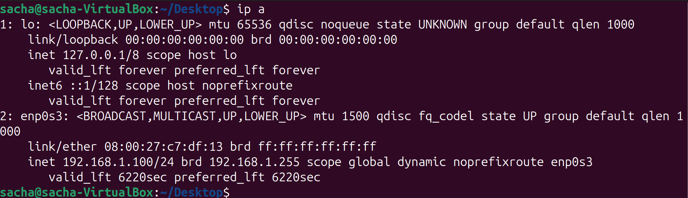

### 5. DNS

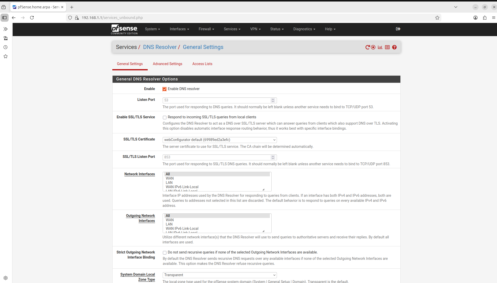

#### .Questions

- Pourquoi un pare-feu peut-il jouer le rôle de serveur DNS ?   
-Performance : Il peut mettre en cache les requêtes pour accélérer la navigation.  
-Sécurité : Il permet de filtrer les noms de domaines et de bloquer l'accès à des sites malveillants ou dangereux avant même que la connexion ne soit établie.   
-Contrôle : L'administrateur garde une visibilité sur les sites consultés sur le réseau.

- Que se passe-t-il si le DNS ne fonctionne pas mais que le ping vers 8.8.8.8 fonctionne ?   
-Cela signifie que la connexion Internet est active (la route est bonne), mais que le système de traduction des noms est en panne.   
-Concrètement, l'utilisateur ne pourra plus accéder à des sites via leurs noms (ex: google.fr), car le navigateur ne saura pas transformer ce texte en adresse IP. Internet paraîtra "coupé" pour la navigation web classique.

## Partie 4 – Autoriser l’accès Internet

### 6. Règles de pare-feu

6. Règles de pare-feu

- Pour permettre un accès Internet maîtrisé depuis le LAN, j'ai choisi de ne pas utiliser la règle par défaut "Allow All", mais de créer des règles spécifiques pour chaque besoin :

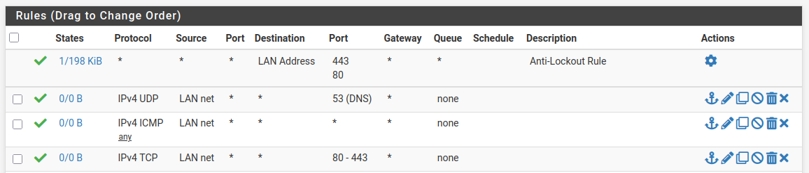

#### .Questions 

- Quelle doit être la source ?   
La source est LAN net, ce qui correspond à l'ensemble du sous-réseau local (192.168.1.0/24) où se trouve la machine Ubuntu.

- Quelle doit être la destination ?   
La destination est any. Pour accéder à Internet, on ne peut pas restreindre à une IP précise car les sites web sont répartis sur tout le réseau public.

- Faut-il autoriser tous les protocoles ?  
Non. Dans une approche professionnelle, on n'autorise que le nécessaire (TCP pour le web, UDP pour le DNS). Autoriser "tous les protocoles" (Any) est plus simple mais moins sécurisé, car cela pourrait laisser passer des flux indésirables ou malveillants.

#### .Tests de connectivité

- Ping vers pfSense (192.168.1.1) :

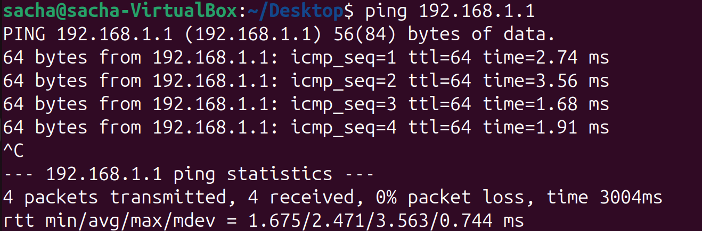

- Ping vers 8.8.8.8 :

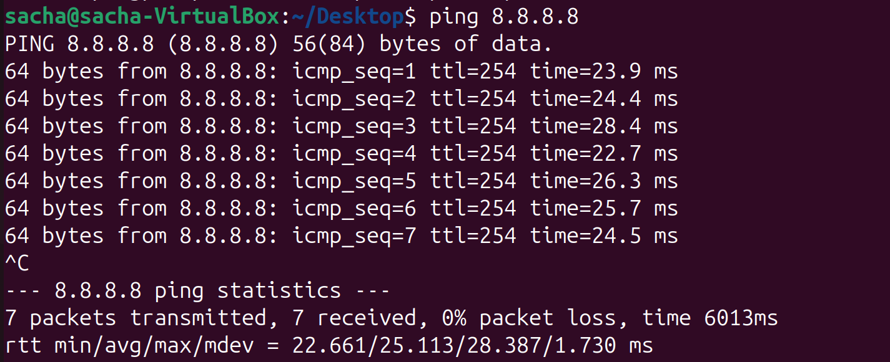

- Test DNS :

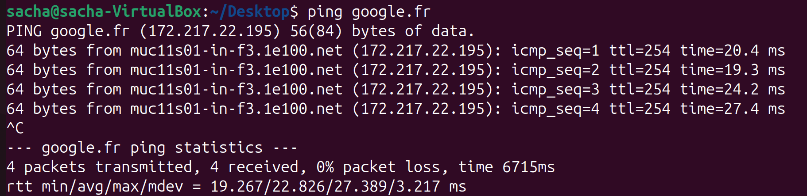

- Accès Web (Firefox) :

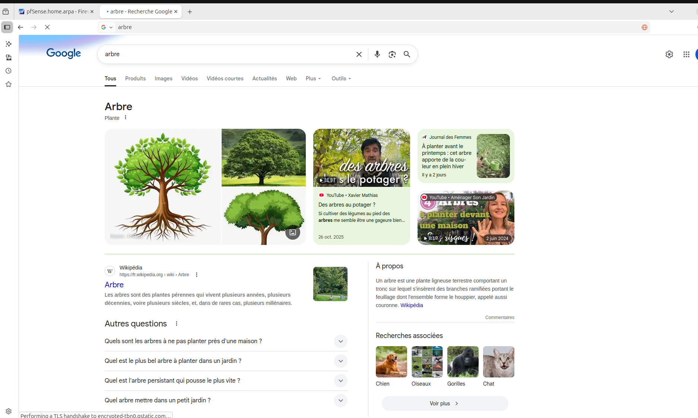

#### .Si ça ne fonctionne pas :

Si l'accès avait échoué, les points de contrôle auraient été :

- Les Logs : Consulter Status > System Logs > Firewall pour voir quelle règle bloque le trafic.

- Le NAT : Vérifier que le Outbound NAT est bien actif pour traduire l'IP privée en IP publique.

- L'Ordre des règles : S'assurer qu'une règle "Block" globale n'est pas placée au-dessus de mes règles d'autorisation.

### 7. NAT

#### Vérifiez la configuration du NAT sortant.

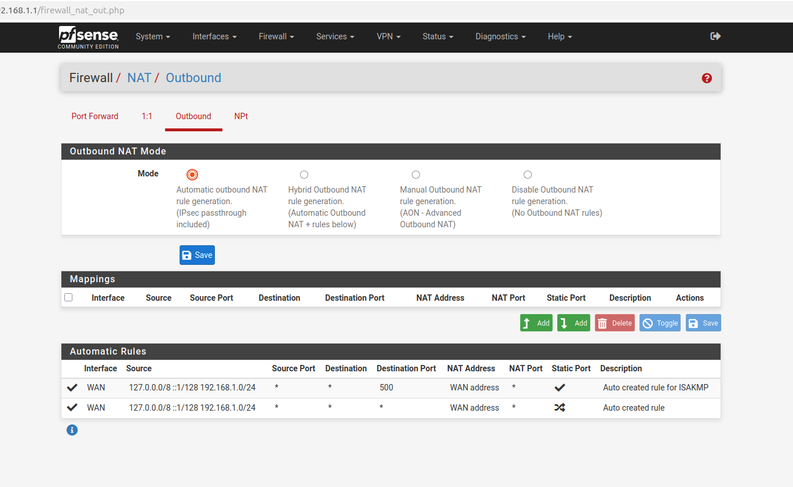

#### .Questions 

- Pourquoi le NAT est-il nécessaire avec une interface WAN en NAT ?  
Ton Ubuntu possède une adresse IP locale (192.168.1.100) qui n'est pas reconnue sur Internet.  
Même si l'interface WAN de pfSense est elle-même en NAT par VirtualBox, pfSense doit effectuer sa propre traduction pour remplacer l'IP d'Ubuntu par son IP WAN (10.0.2.15). Sans cela, les paquets de retour ne sauraient jamais comment revenir jusqu'à ton réseau local.

- Quelle est la différence entre NAT automatique et manuel ?  
**NAT automatique :** pfSense gère tout seul la création des règles de traduction pour chaque réseau interne. C'est ce qu'on voit sur ta capture image_2d9a06.png dans la section "Automatic Rules".  
**NAT manuel :** L'administrateur doit créer chaque règle à la main dans la section "Mappings". C'est plus précis pour des réseaux complexes, mais une erreur peut couper totalement l'accès Internet.

- Comment vérifier qu’une traduction d’adresse a lieu ?  
**Dans l'interface :** En allant dans Diagnostics > States, on peut voir les sessions actives montrant la correspondance entre l'IP interne (192.168.1.100) et l'IP WAN.  
**Depuis Ubuntu :** En utilisant un site comme ifconfig.me ou mon-ip.io. L'adresse affichée ne sera pas celle d'Ubuntu, mais l'IP publique de ta box réelle, prouvant que la chaîne de traduction (NAT pfSense + NAT VirtualBox) a bien fonctionné.

## Partie 5 – Filtrage

### 8. Blocage d'un site spécifique

On chercher l'IP du site facebook: 

`nslookup facebook.com`

Puis on la block: 

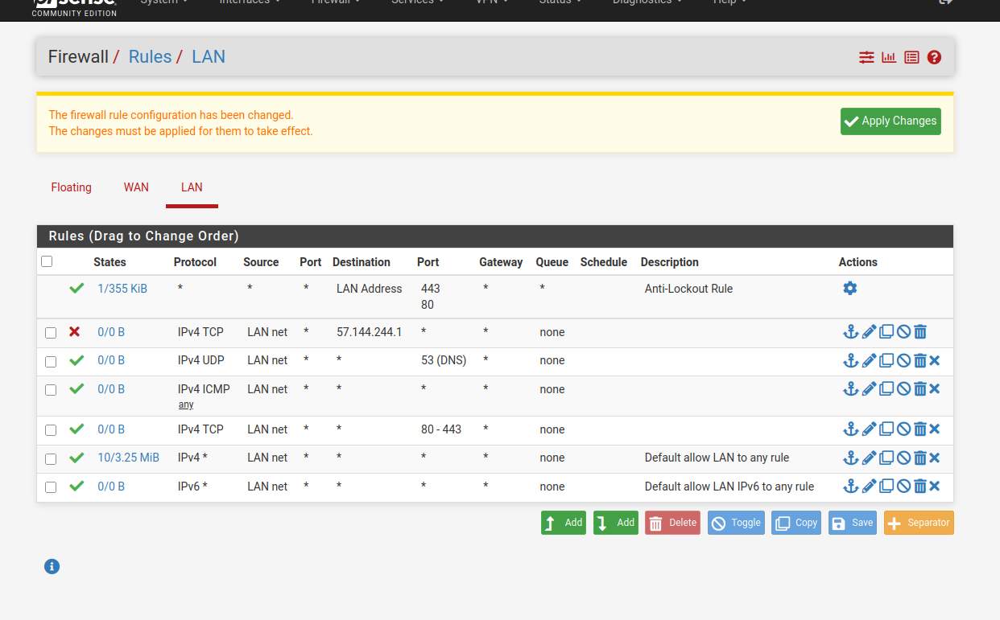

#### .Questions

- Faut-il bloquer par IP ou par nom de domaine ?  
On bloque ici par IP.  
**Pourquoi :** Le pare-feu classique filtre les paquets réseau. Pour bloquer par nom de domaine, il faudrait un outil plus évolué comme un proxy ou un filtre DNS (pfBlockerNG) qui analyse le contenu des requêtes.

- Que se passe-t-il si le site utilise HTTPS ?   
Le blocage fonctionne (la connexion est coupée), mais le navigateur affichera une erreur générique du type "Le délai d'attente est dépassé" au lieu d'une page propre "Ce site est bloqué par votre administrateur".

- Pourquoi le blocage par IP peut-il être contourné ?  
**Multiplicité des IPs :** Un site comme Facebook possède des milliers d'adresses IP. Si tu n'en bloques qu'une, le navigateur peut essayer d'en utiliser une autre.  
**VPN / Proxy :** L'utilisateur peut passer par un tunnel chiffré qui cache la destination finale au pare-feu.

Le blocage a été validé avec succès : après avoir appliqué la règle d'interdiction (Block) pour l'adresse IP de destination, l'accès au site depuis le navigateur Ubuntu a été immédiatement interrompu et les tentatives de connexion rejetées apparaissent bien dans les logs du pare-feu.

### 9. Blocage d’une catégorie de sites (jeux d’argent)

#### Créez une solution propre et maintenable pour bloquer plusieurs sites.

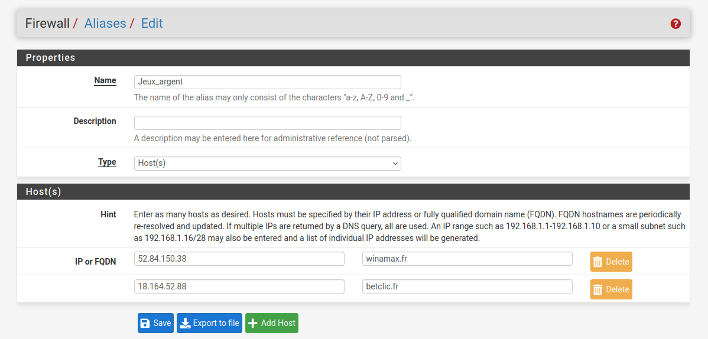

#### .Questions :

- Pourquoi ne pas créer une règle par site ?      
Pour la lisibilité et la maintenance. Si on doit bloquer 100 sites, une seule règle utilisant un alias est beaucoup plus simple à gérer que 100 règles individuelles qui alourdiraient le pare-feu.

- Où se créent les alias ?   
Ils se créent dans le menu Firewall > Aliases.

- Comment vérifier qu’une règle bloque réellement le trafic ?   
On vérifie dans les logs (Status > System Logs > Firewall) que l'icône rouge apparaît bien pour ces destinations. On peut aussi regarder la colonne States dans les règles : si le compteur augmente, c'est que la règle travaille.

## Partie 6 – Aller plus loin

### 10. Blocage par catégorie 

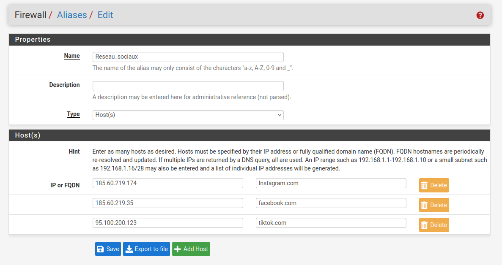

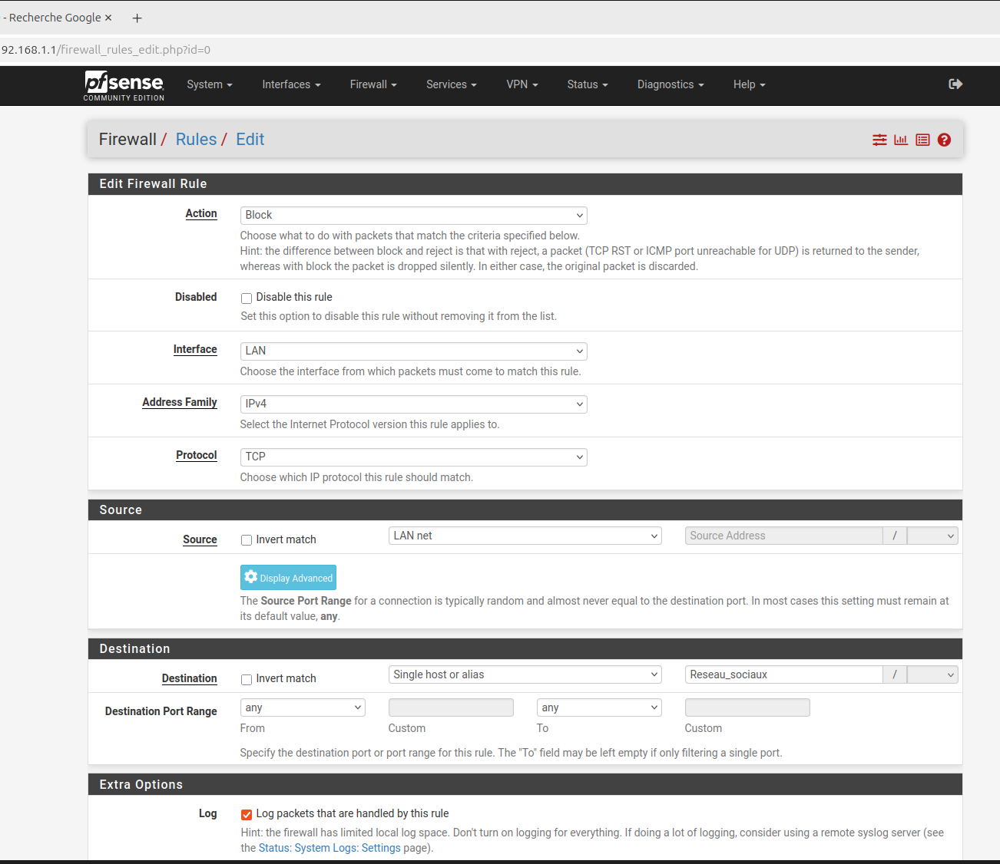

on fait un curl vers l'adress de tiktok:
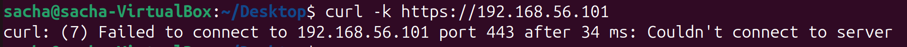

#### .Questions

- Que se passe-t-il si la règle est placée sous une règle "Pass Any" ?  
La règle de blocage ne fonctionnera pas et sera totalement ignorée.

### 11. Règles horaires

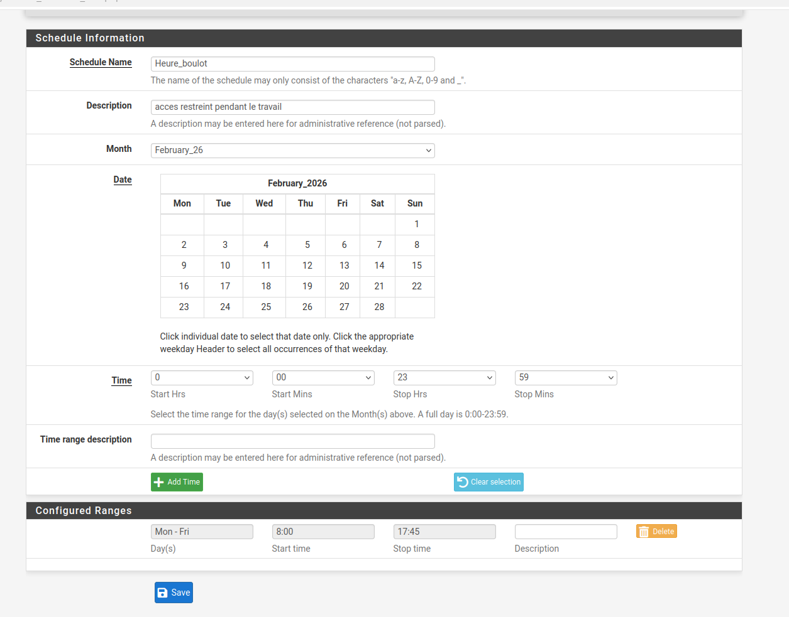

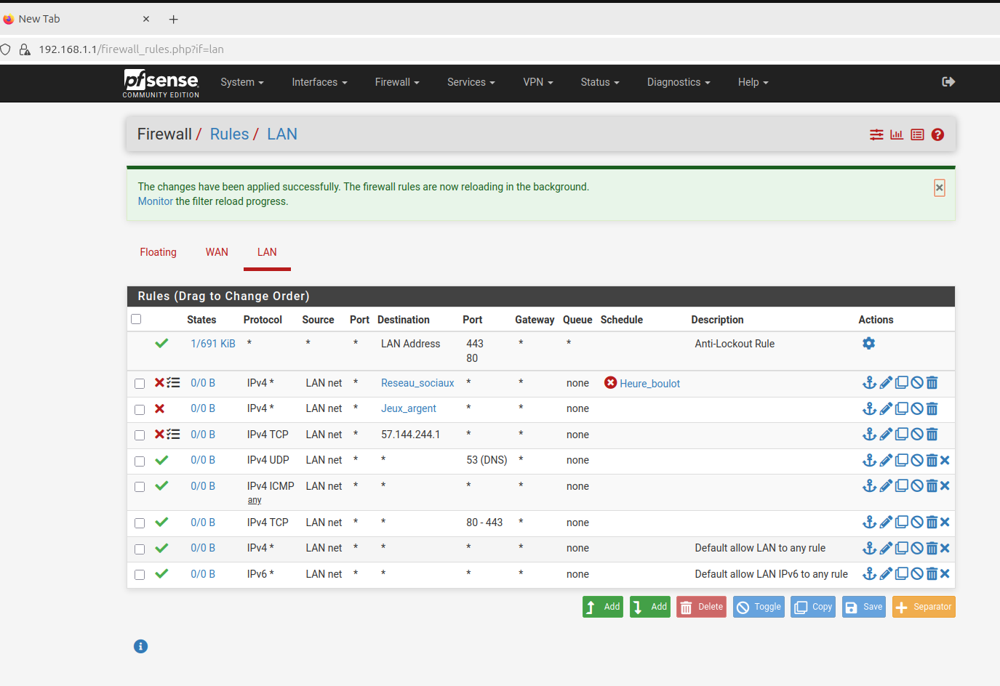
#### .Questions

- Pourquoi les règles horaires sont-elles utiles en entreprise ?  
Les règles horaires sont utiles car elles permettent d'automatiser une politique de sécurité flexible, en limitant l'accès aux sites non productifs et en fermant les accès sensibles durant les périodes d'inactivité, optimisant ainsi la sécurité et la bande passante selon les besoins réels de l'entreprise.

### 12. Serveur web local

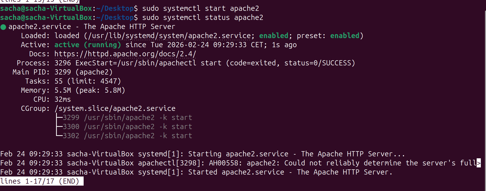

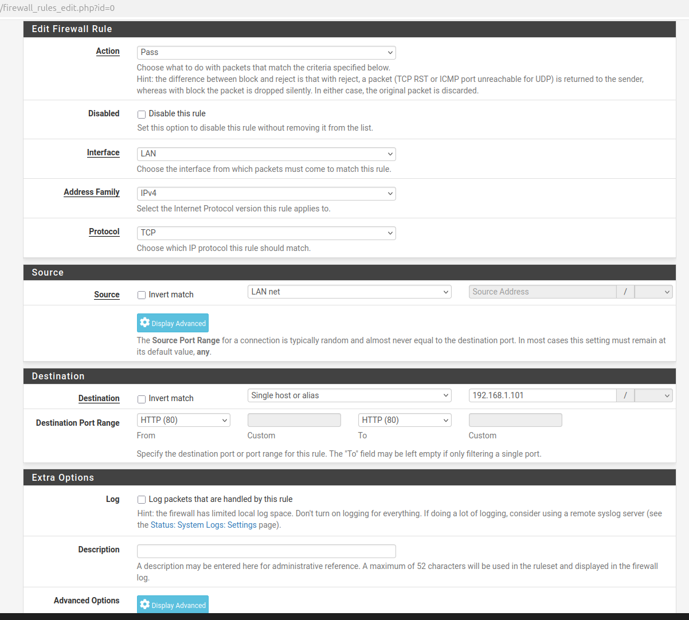

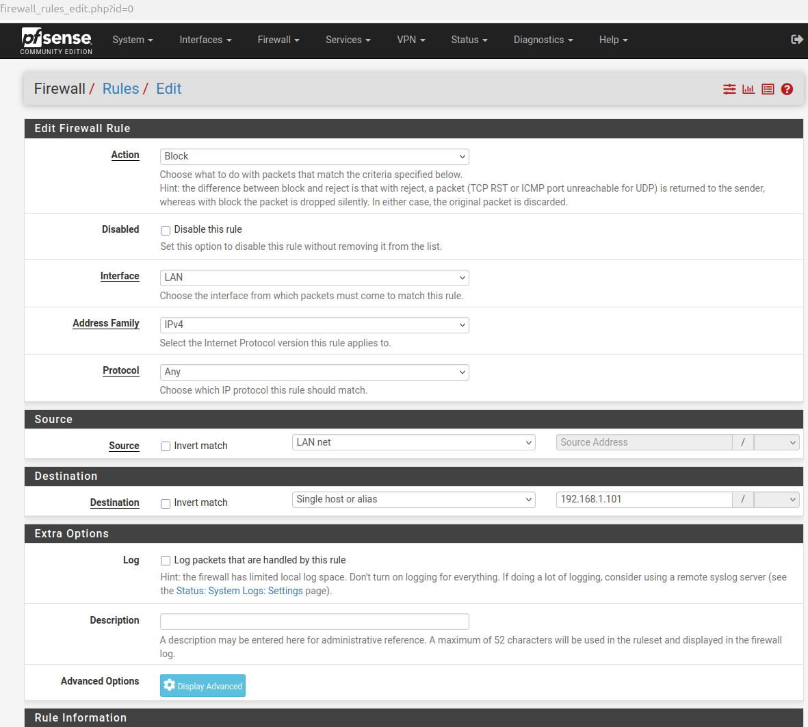

#### .Questions

- Filtrer par IP source ?   
Cela consiste à autoriser ou bloquer le trafic en fonction de l'adresse IP de la machine qui émet la requête. En entreprise, cela permet de s'assurer que seuls certains ordinateurs autorisés (ex: le poste de l'administrateur) peuvent accéder à des ressources sensibles comme le serveur Web ou l'interface de gestion du pare-feu.

- Filtrer par port ?  
Le filtrage par port permet de ne laisser passer que les services spécifiques dont on a besoin. Par exemple, ouvrir le port 80 (HTTP) pour le site web tout en fermant le port 22 (SSH) empêche un attaquant de tenter de prendre le contrôle du serveur à distance, même s'il connaît son adresse IP.

- Pourquoi le pare-feu protège-t-il le LAN même en réseau interne ?  
Même si toutes tes machines sont dans un "Réseau Interne" virtuel, le pare-feu est indispensable pour plusieurs raisons :   
**Le compartimentage (Segmentation) :** Le pare-feu agit comme une porte blindée entre différentes zones du réseau. Si une machine du LAN est infectée par un virus, le pare-feu peut empêcher ce virus de se propager vers d'autres serveurs sensibles en bloquant les flux internes suspects.   
**Le contrôle de l'exfiltration :** Le pare-feu ne surveille pas seulement ce qui entre, mais aussi ce qui sort. Il empêche une machine compromise d'envoyer des données vers des serveurs malveillants à l'extérieur.   
**La visibilité et l'audit :** Sans pare-feu, tu n'as aucune trace du trafic interne. Grâce aux logs de pfSense, tu peux voir en temps réel qui accède à quoi, ce qui est essentiel pour détecter une activité anormale sur le LAN.

### 13. Logs et analyse

- L'activation de la journalisation (Logging) sur les règles de blocage permet d'auditer en temps réel la sécurité du réseau. L'analyse des logs dans pfSense confirme visuellement l'efficacité des politiques mises en place : les accès non autorisés sont clairement identifiés par des indicateurs rouges, tandis que les flux légitimes vers le serveur Web sont validés, offrant ainsi une traçabilité complète de l'activité sur le LAN.

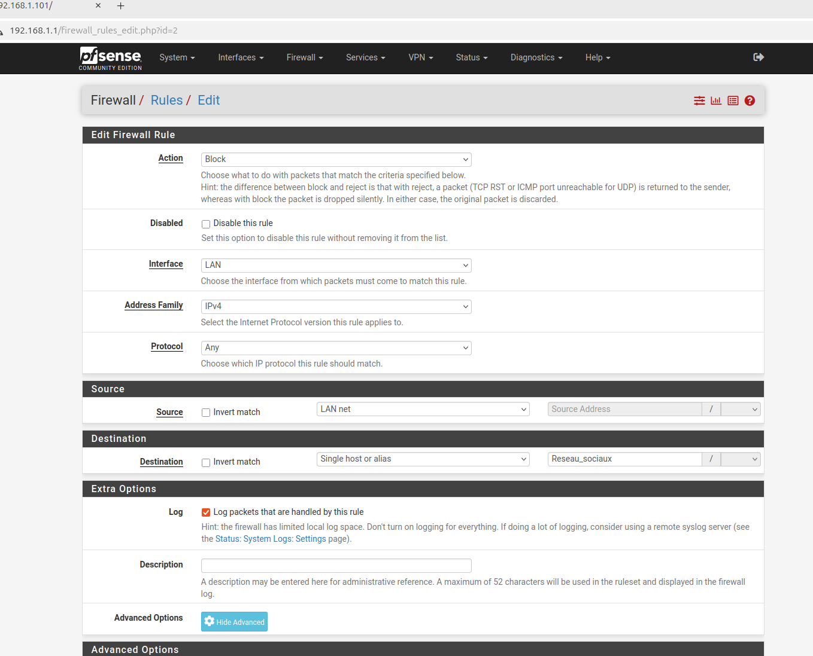

#### .Questions

- **Différence entre paquet bloqué et autorisé :**  
**Paquet Bloqué (Block) :** Il apparaît généralement avec une icône de croix rouge dans les logs. Le pare-feu a stoppé le paquet ; aucune connexion n'est établie. S'il est "Reject", le pare-feu renvoie une erreur à la source, s'il est "Block", il ignore simplement le paquet .  
**Paquet Autorisé (Pass) :** Il apparaît avec une icône de flèche verte. Le trafic a été autorisé à traverser l'interface. Par défaut, pfSense ne logue pas les paquets autorisés pour ne pas saturer le disque, sauf si tu as coché "Log" sur la règle correspondante.

- **Identifier quelle règle a déclenché le blocage :**  
Dans l'onglet Status > System Logs > Firewall, chaque ligne de log possède une colonne "Rule".  
En cliquant sur l'icône de la règle dans cette colonne (ou sur le numéro), pfSense t'indique précisément le nom et la description de la règle qui a intercepté le trafic. Cela permet de savoir si c'est ta règle "Reseaux_Sociaux" ou la règle de sécurité par défaut qui a agi.

- **Comprendre le sens du trafic :**   
Le sens est déterminé par les colonnes Source et Destination.      
Trafic Sortant : Si la source est une IP du LAN (ex: 192.168.1.101) et la destination une IP publique ou un port spécifique, c'est ton PC qui tente d'accéder à l'extérieur.   
Trafic Entrant : Si la source est une IP inconnue et la destination est l'IP de ton serveur Ubuntu, c'est une tentative d'accès vers ton réseau interne.

### 15. Filtrage MAC
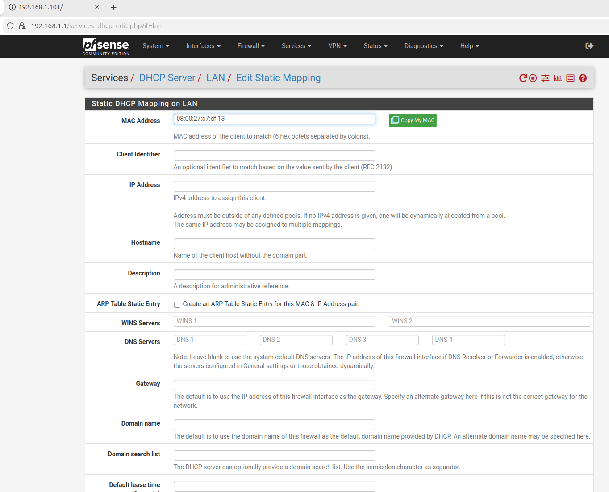

- Dans les options du serveur DHCP, tu peux cocher "Deny unknown clients" pour que seules les adresses MAC enregistrées reçoivent une IP.

#### .Questions

- **Le filtrage MAC est-il réellement sécurisé ?**   
Non, il n'offre qu'une sécurité très superficielle. Il est considéré comme une mesure de protection "faible" car il repose sur un identifiant qui circule en clair sur le réseau et qui n'est pas authentifié.

- **Pourquoi est-il facilement contournable ?**   
Il est facilement contournable à cause du MAC Spoofing (usurpation d'adresse MAC). Un attaquant peut utiliser un logiciel de "sniffing" pour voir quelles adresses MAC sont autorisées sur le réseau, puis changer l'adresse MAC de sa propre carte réseau pour cloner celle d'une machine autorisée et ainsi tromper le pare-feu.

### 16. Portail captif

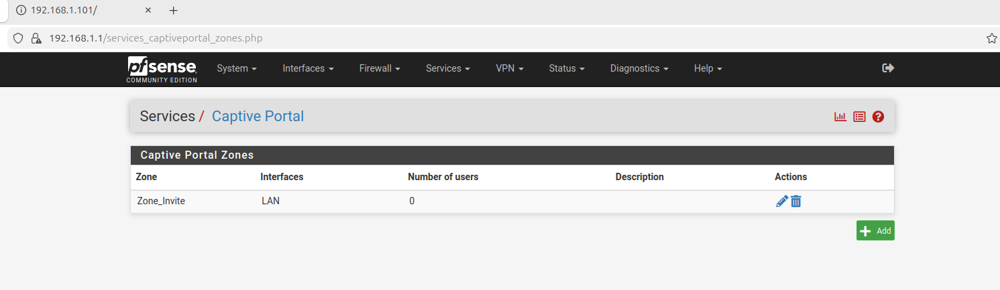

- Pour activer cette fonctionnalité :

Va dans Services > Captive Portal.

Clique sur Add pour créer une nouvelle zone (ex: Zone_Invite).

Coche la case Enable Captive Portal.

Choisis l'interface LAN.

Dans Authentication Method,selectionné celle qui fait office de "No Authentication".

Save les modifications.

#### .Questions

- **Dans quels contextes utilise-t-on cela ?**  
Le portail captif est principalement utilisé dans les lieux publics ou semi-publics pour gérer les accès "invités". On le retrouve couramment dans :  
-Les hôtels, cafés et aéroports (Wi-Fi public).   
-Les réseaux d'entreprises pour les visiteurs (séparés du réseau interne).  
-Les établissements scolaires ou bibliothèques pour tracer l'activité des utilisateurs.

- **Quelle(s) avantage(s) par rapport à une simple règle de pare-feu ?**  
Contrairement à une règle de pare-feu classique qui filtre selon des critères techniques (IP, Port), le portail captif offre :  
-L'authentification utilisateur : On sait exactement qui se connecte, pas seulement quelle machine.  
-Le contrôle légal : Il permet d'afficher et de faire accepter des Conditions Générales d'Utilisation (CGU), ce qui protège l'entreprise juridiquement.  
-La monétisation ou Marketing : On peut limiter le temps de connexion, le débit, ou demander une adresse email pour le marketing.

### 17. Sauvegarde / restauration

- 1. Sauvegarder la configuration:
Va dans le menu Diagnostics > Backup & Restore.

Laisse les options par défaut (Backup area : ALL).

Clique sur Download configuration as XML.

Un fichier nommé config-pfsense...xml va se télécharger sur ton PC.

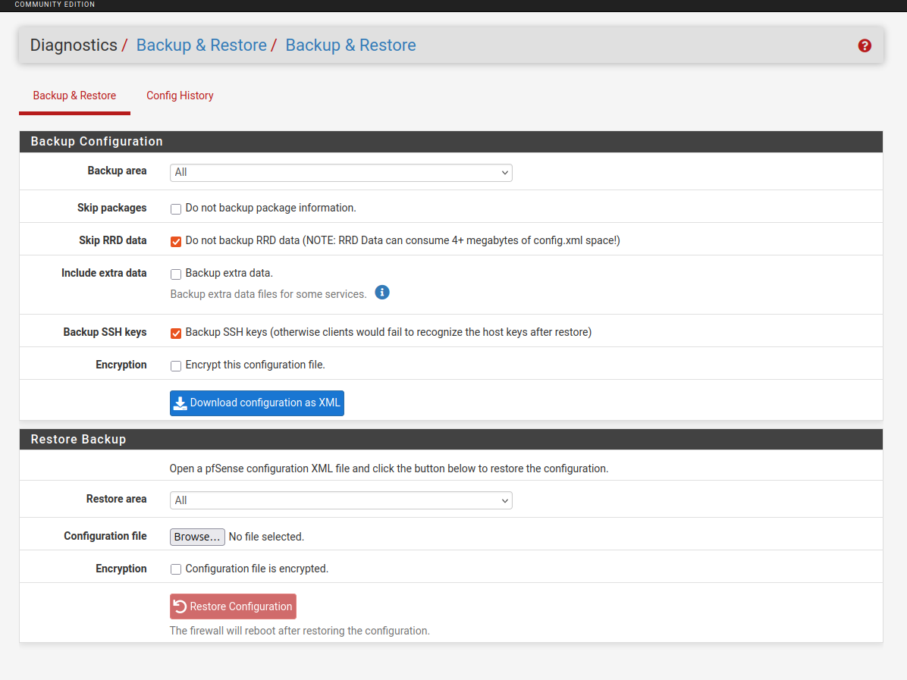

- 2. Modifier la configuration:
On va dans nos règles de pare-feu et supprime une des règles (par exemple celle du serveur Web).

Apply Changes. Le serveur n'est plus accessible : on a "cassé" la prod.

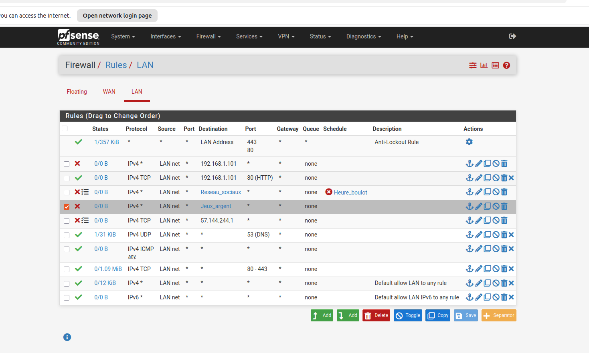

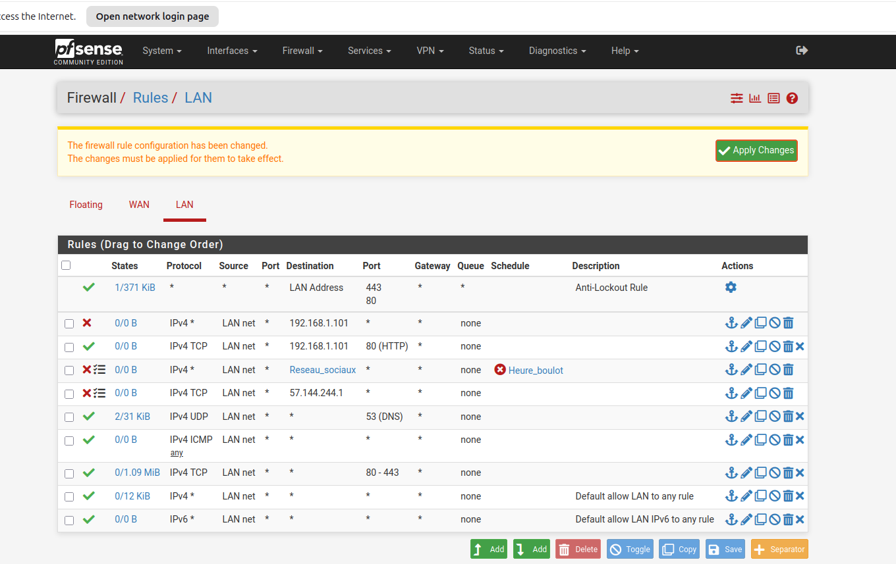

- 3. Restaurer la configuration:
Retourne dans Diagnostics > Backup & Restore.

Dans la section Restore configuration, clique sur Parcourir (ou "Choose File") et on sélectionne le fichier XML.

Clique sur Restore Configuration.

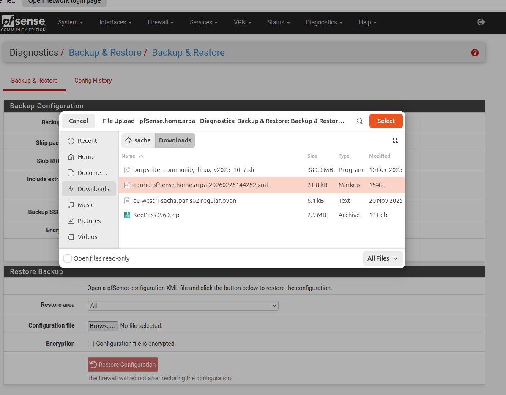

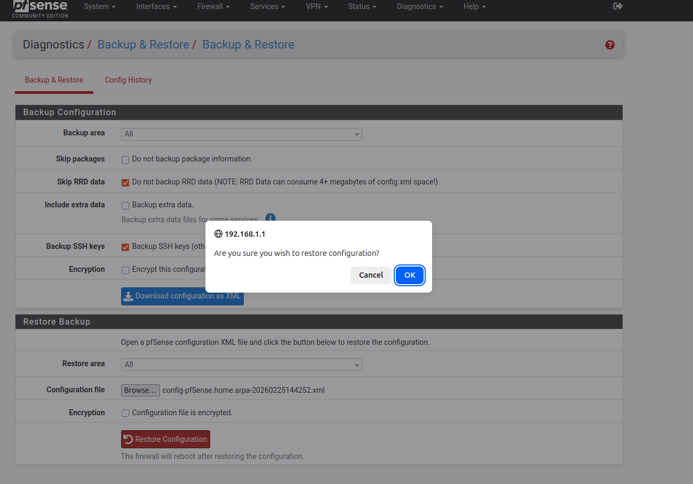

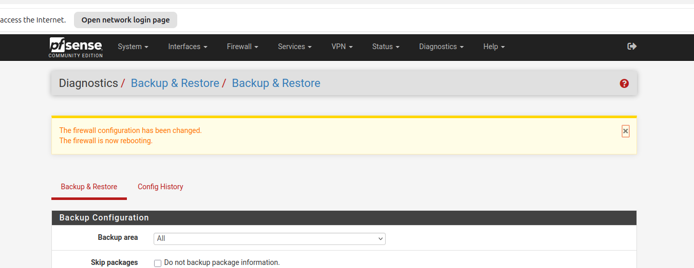

et on remarque bien que la VM Pfsense ce reboot.

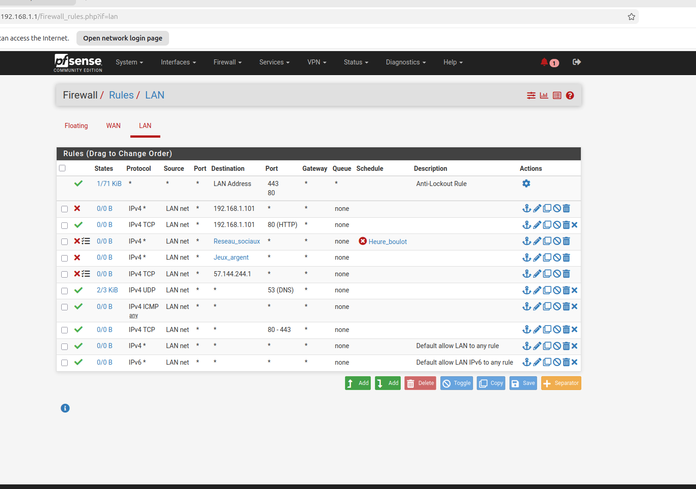 

et nous somme bien revenu sur la version enregistrer. 

#### .Questions

- **Pourquoi la sauvegarde régulière est-elle essentielle en production ?**  
La sauvegarde est vitale car elle garantit la continuité d'activité de l'entreprise. En cas de panne matérielle, d'erreur humaine ou de cyberattaque, une sauvegarde récente permet de restaurer l'intégralité des règles de pare-feu, des alias et des accès VPN en quelques minutes. Sans cela, l'administrateur devrait tout reconfigurer manuellement, entraînant un arrêt prolongé et coûteux des services réseau.