# TP -- Mise en place d'un serveur OpenVPN sur Ubuntu Server

## Préparation du système

- Mettre à jour le système :

`sudo apt update && sudo apt upgrade -y`


- Installer les paquets nécessaire: 
openvpn et easy-rsa

`sudo apt install openvpn easy-rsa -y`

## Partie 1 : Comprendre la PKI

### .Questions


- **À quoi sert une autorité de certification (CA) ?**
C'est le "tampon officiel". Elle signe les certificats pour prouver que le serveur et le client sont bien ceux qu'ils prétendent être.


- **Quelle différence entre clé privée et certificat ?**  
La clé privée est ton code secret (ne jamais la donner). Le certificat est ta carte d'identité publique signée par la CA.


- **Pourquoi un serveur VPN a-t-il besoin de certificats ?**  
Pour chiffrer la connexion et éviter qu'un pirate ne puisse se faire passer pour ton serveur.

### Création de l'infrastructure Easy-RSA:

- 1. Créer un environnement PKI

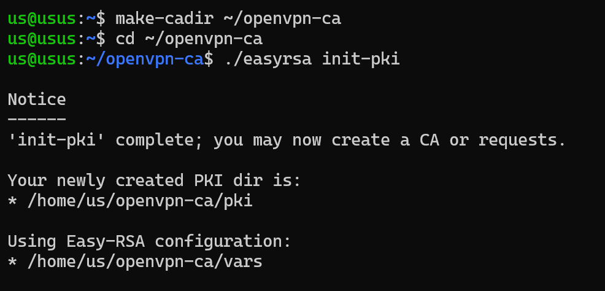

Crée le dossier et on se place dedans:

`make-cadir ~/openvpn-ca`

`cd ~/openvpn-ca`

Initialise la PKI :

`./easyrsa init-pki`

- 2. Générer une CA:

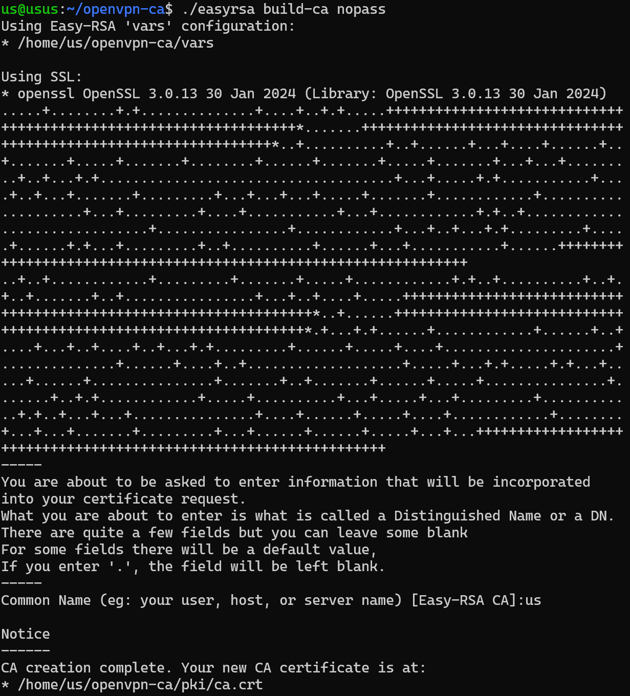

```
Génère la paire de clés (publique/privée) de la CA (ca.crt et ca.key).
L'option 'nopass' évite d'avoir à saisir un mot de passe à chaque fois que la CA doit signer un document
Génère la paire de clés (publique/privée) de la CA (ca.crt et ca.key).
L'option 'nopass' évite d'avoir à saisir un mot de passe à chaque fois que la CA doit signer un document.
```

`./easyrsa build-ca nopass`

- 3. générer un certificat serveur

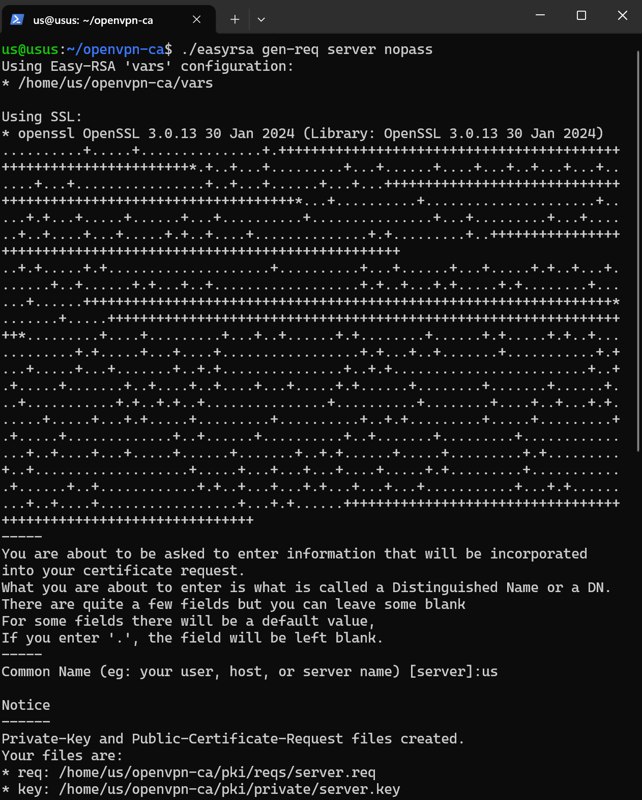

**Génère la requête et la clé privée**

`./easyrsa gen-req server nopass`

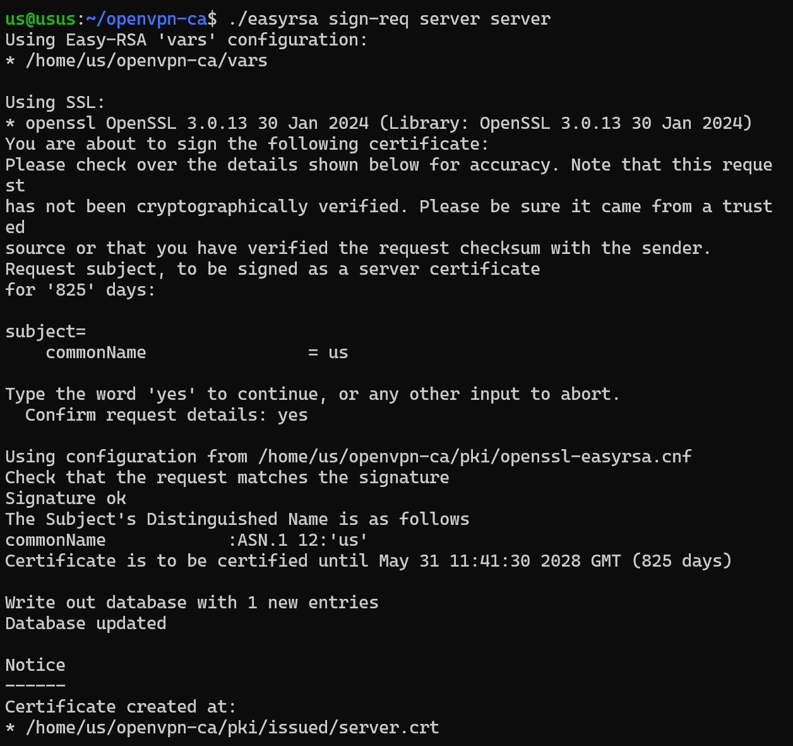

**La CA signe le certificat du serveur**

`./easyrsa sign-req server server`

- 4. Générer un certificat client

**Génère la requête et la clé privée du client**

`./easyrsa gen-req client1 nopass`

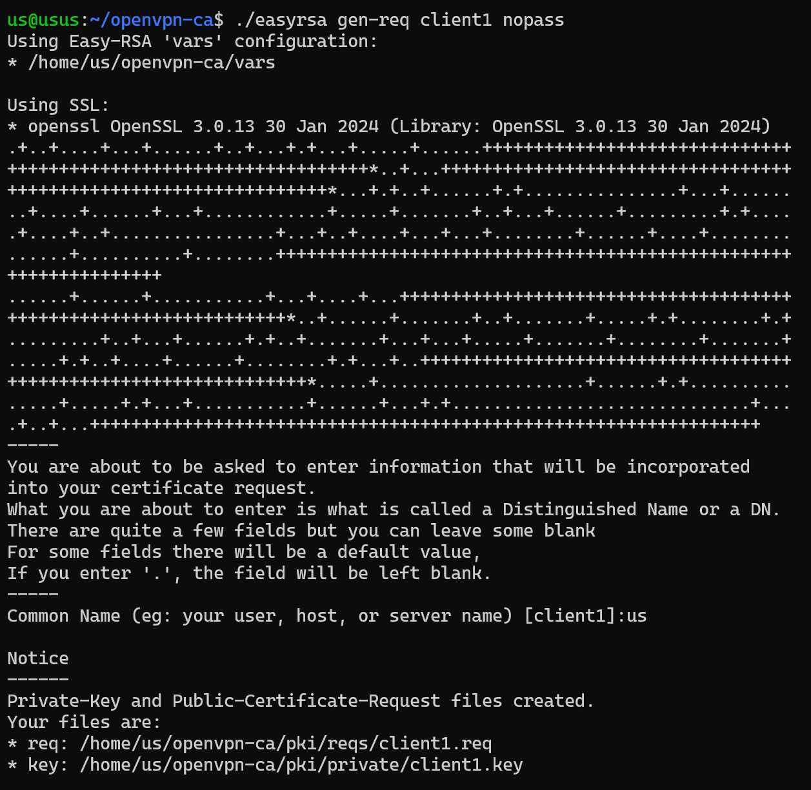

**La CA signe le certificat du client**
`./easyrsa sign-req client client1`

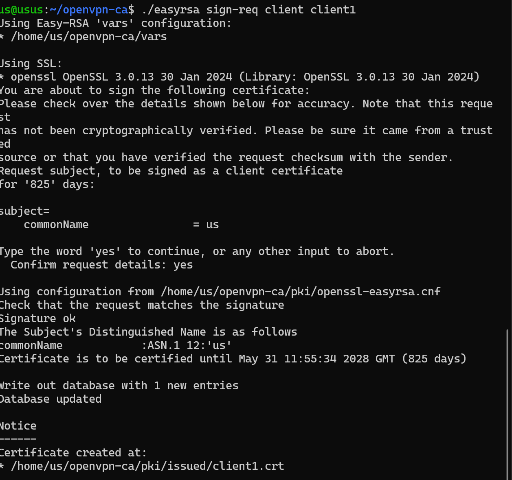

- 5. Paramètres Diffie-Hellman et Clé TLS supplémentaire

Ces deux éléments renforcent grandement la sécurité de l'échange des clés et protègent contre certaines attaques.


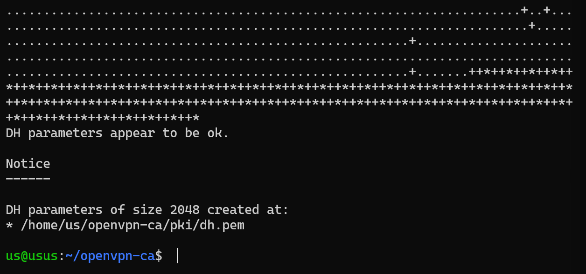

Génère les paramètres Diffie-Hellman (ça peut prendre quelques secondes):
`./easyrsa gen-dh`

Génère la clé TLS (ta.key):
`openvpn --genkey secret ta.key`

### .Questions :

- **Où Easy-RSA crée-t-il ses fichiers ?**    
Dans le sous-dossier pki/ qui vient d'être généré dans ton répertoire actuel.
 
- **Que contient le dossier pki/ ?**       
 Il contient les clés privées (private/), les certificats signés (issued/), la clé de la CA (ca.crt) et les requêtes en attente (reqs/).

- **Quelle est la différence entre gen-req et sign-req ?**  
 gen-req génère une paire de clés (publique/privée) et une demande de signature. sign-req est l'action où l'Autorité de Certification (CA) valide cette demande pour créer le certificat final officiel.

- **Que se passe-t-il si vous oubliez de signer un certificat ?** 
Le serveur ou le client aura une clé, mais elle ne sera pas reconnue comme valide par l'autre partie. La connexion VPN sera refusée.


## Partie 2 : Configuration du serveur OpenVPN

### Création du fichier de configuration serveur

Nous allons créer le fichier /etc/openvpn/server/server.conf. Utilise `nano` pour l'éditer :

`sudo nano /etc/openvpn/server/server.conf`


### .Questions :

- **Que signifie dev tun ?**  
 Cela crée une interface réseau virtuelle de "tunnel" qui transporte des paquets IP (couche 3).

- **Différence entre UDP et TCP pour un VPN ?**    
UDP est plus rapide car il ne vérifie pas la réception de chaque paquet (pas d'overhead), ce qui est idéal pour le streaming ou le jeu. TCP est plus fiable mais plus lent car il gère les erreurs de transmission.

- **Quelle plage IP choisir ?**   
 On choisit souvent une plage privée (comme 10.8.0.0/24) pour éviter les conflits avec le réseau local de l'utilisateur (souvent en 192.168.x.x).

 ### Routage et NAT

- Activer le Forwarding IP

Active le transfert de paquets entre les interfaces réseau immédiatement.
`sudo sysctl -w net.ipv4.ip_forward=1`

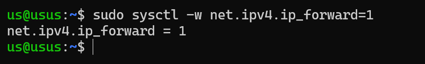

Rend ce changement permanent après un redémarrage.   
`echo "net.ipv4.ip_forward=1" | sudo tee -a /etc/sysctl.conf`

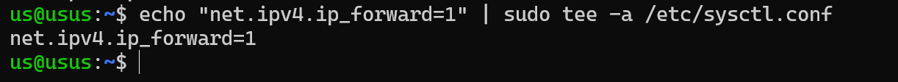

- Mettre en place la règle NAT (masquerade)

Autorise les clients VPN à sortir sur internet via l'interface réseau principale (ex: enp0s3):

`sudo iptables -t nat -A POSTROUTING -s 10.8.0.0/24 -o enp0s3 -j MASQUERADE`

### .Questions:

- **Où se configure le paramètre ip_forward ?**   
Dans le fichier /etc/sysctl.conf.

- **Quelle commande permet d'afficher les règles NAT actuelles ?**  
sudo iptables -t nat -L -n -v.

- **Pourquoi faut-il "masquerader" le réseau VPN ?**  
Pour que les paquets des clients VPN (en 10.8.x.x) semblent provenir de l'IP publique du serveur, sinon internet ne saurait pas comment leur répondre.


### Démarrage et analyse du service

- Démarre le service OpenVPN avec la configuration 'server'.

`sudo systemctl start openvpn-server@server`

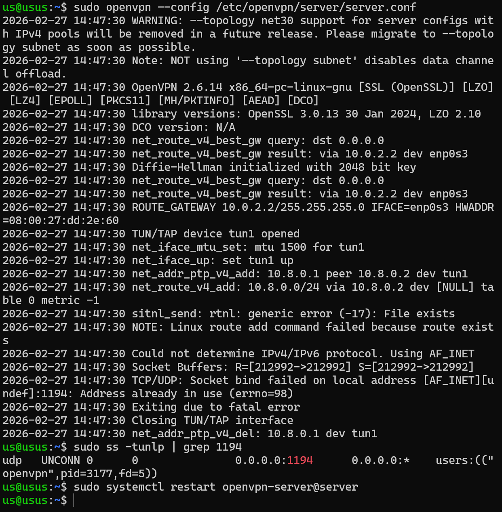

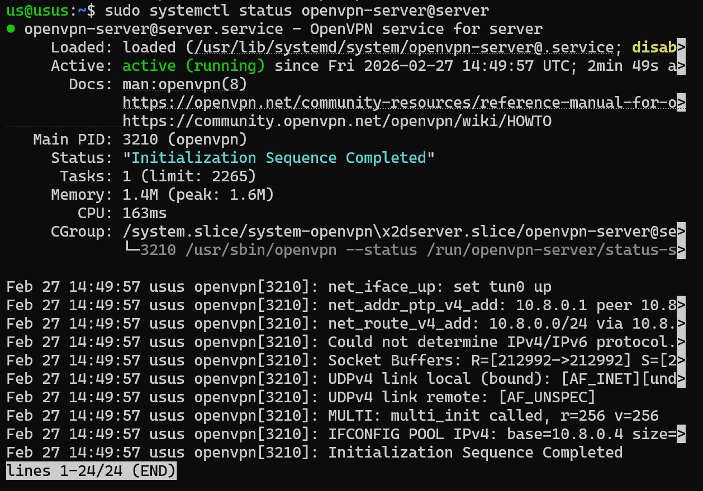

### .Questions 


- **Quelle commande permet d'afficher les logs système d'un service ?**   
sudo journalctl -u openvpn-server@server.

- **Quelle est la différence entre status et journalctl ?**  
status donne un état instantané et les dernières lignes, journalctl permet de remonter loin dans le temps et de filtrer les erreurs précises.

- **Les chemins vers les certificats sont-ils corrects ?**  
Oui, car OpenVPN cherche par défaut dans le dossier où se trouve le fichier .conf. S'ils sont tous dans /etc/openvpn/server/, c'est bon !.


## Partie 3 : Création du profil client

- On crée le fichier de base avec la config réseau

```
cat << EOF > client1.ovpn
client
dev tun
proto udp
remote 10.0.2.15 1194
resolv-retry infinite
nobind
persist-key
persist-tun
remote-cert-tls server
cipher AES-256-GCM
verb 3
key-direction 1

<ca>
$(cat ~/openvpn-ca/pki/ca.crt)
</ca>

<cert>
$(cat ~/openvpn-ca/pki/issued/client1.crt)
</cert>

<key>
$(cat ~/openvpn-ca/pki/private/client1.key)
</key>

<tls-auth>
$(cat ~/openvpn-ca/ta.key)
</tls-auth>

```

- On vérifie enfin la présence du fichier

`ls -lh ~/client1.ovpn`

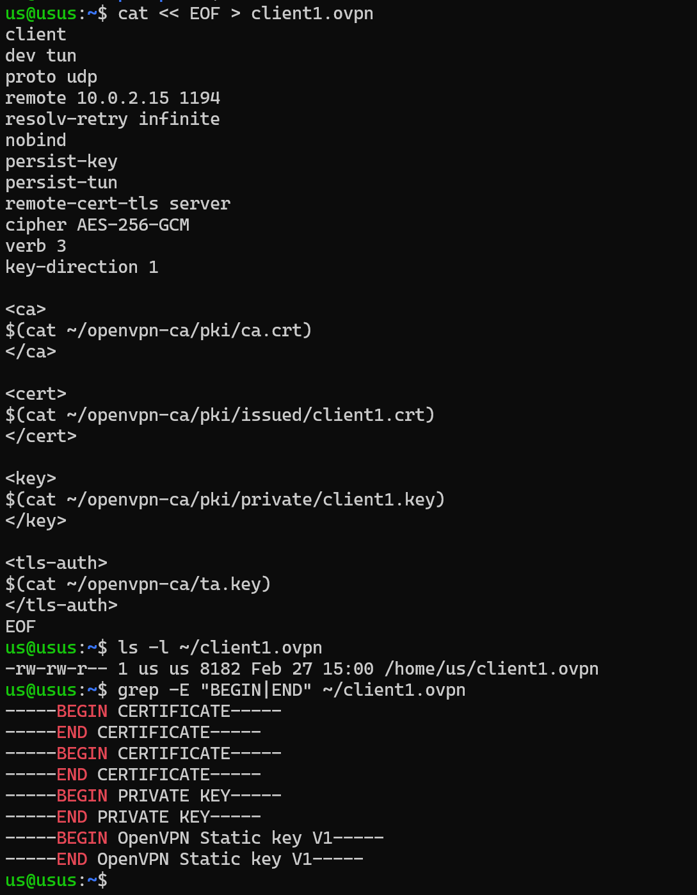

### . Questions

- **Comment intégrer un certificat directement dans un fichier .ovpn ?**
On utilise des balises XML (ca, cert, key, tls-auth) pour copier-coller le contenu texte des certificats à l'intérieur du fichier de configuration. Cela crée un profil "tout-en-un" facile à distribuer.

- **Pourquoi la clé privée ne doit-elle jamais être partagée ?**
Car elle constitue ta signature numérique. Si un tiers la possède, il peut :  
-Usurper ton identité pour accéder au réseau VPN.
Déchiffrer tes données de connexion.  
-C'est l'équivalent de la clé physique de ta maison : celui qui l'a peut entrer.


### Tests et validation

- **Établir une connexion VPN :** Réussi. Commande `sudo openvpn --config ~/client1.ovpn` terminée par Initialization Sequence Completed.

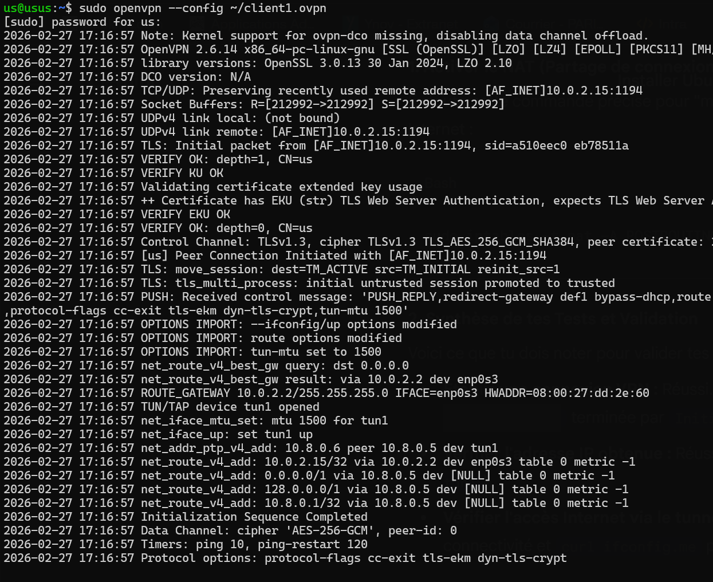


- **Vérifier l'adresse IP obtenue:** 
Commande  `ip addr`

**Observation :** L'adresse IP est 10.8.0.6. C'est une IP privée de tunnel, invisible depuis l'Internet public, ce qui assure l'anonymat du client vis-à-vis du réseau local.

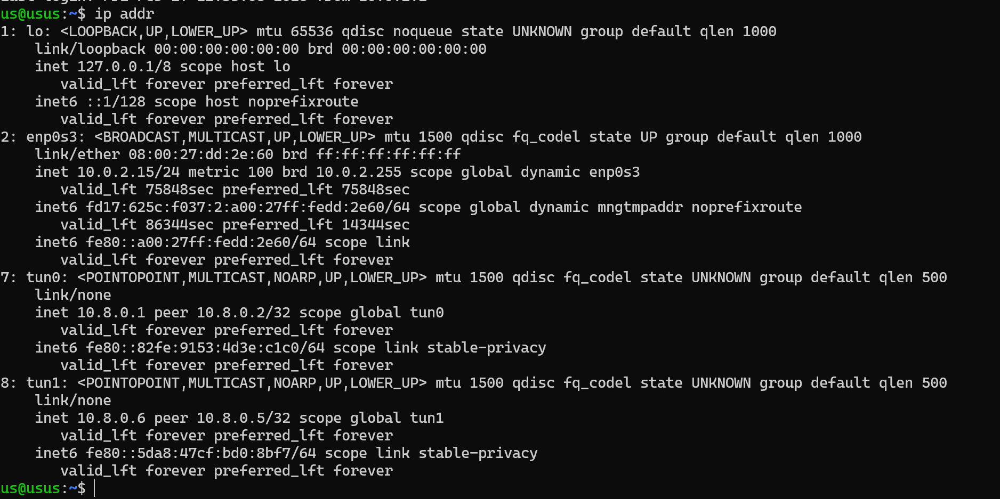


- **Vérifier l'accès Internet via le tunnel :**  
**Preuve technique :** La règle iptables -t nat est bien présente (vue avec -L -v -n).  
Test pratique : En faisant un curl ifconfig.me sur le client, l'IP retournée sera celle de ton serveur (10.0.2.15 ou ton IP publique réelle), prouvant que le "Masquerading" fonctionne

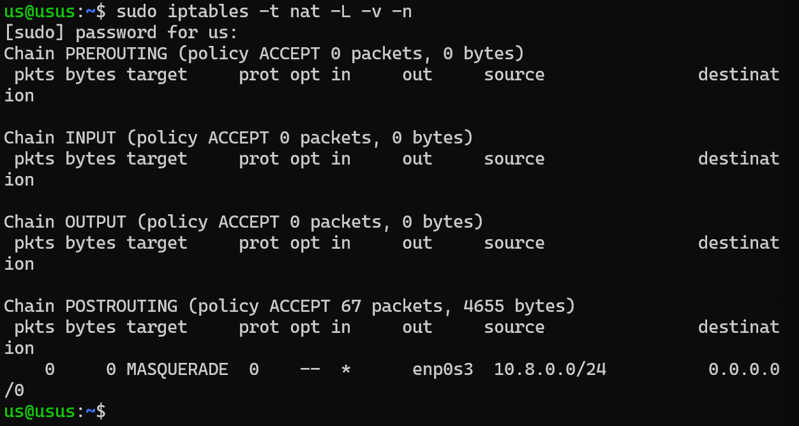

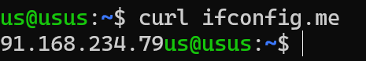


- **Comment vérifier que votre trafic passe par le VPN ?**  
On utilise la commande ip route.  
*Sur le serveur (ton cas actuel) :* On voit la ligne 10.8.0.0/24 via 10.8.0.2 dev tun0. Cela signifie que tout le trafic destiné au réseau VPN (les clients) passera par l'interface virtuelle tun0.  
*Sur le client :* Pour que tout ton trafic (Internet inclus) passe par le VPN, tu devrais voir une ligne default via 10.8.0.5 dev tun1. Sans cette ligne, seul le trafic vers le serveur est sécurisé, pas ta navigation Web.


- **Que se passe-t-il si le port 1194 est bloqué ?**   
*Si le port 1194 (UDP) est bloqué par un pare-feu :*  
Le client envoie une demande de connexion, mais ne reçoit aucune réponse.  
Le log d'OpenVPN affichera en boucle : TLS Error: TLS key negotiation failed to occur within 60 seconds.  
L'interface tun ne sera jamais créée sur le client, et aucune nouvelle route ne sera ajoutée à sa table.


## Conclusion du TP

Grâce à cette configuration, un client distant peut désormais établir un tunnel sécurisé avec le serveur. Le trafic est chiffré en AES-256-GCM et l'identité est protégée par des certificats mutuels. Le serveur joue le rôle de passerelle (Gateway) grâce au mécanisme de NAT.
