# TP4 – Administration SSH et Serveur Web Nginx

## Partie 2 – Serveur SSH

#### 1. Installez le serveur SSH sur la VM.

`sudo apt install openssh-server -y`

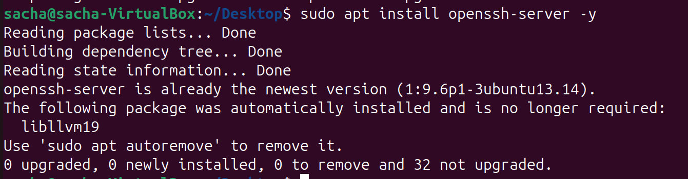

#### 2. Vérifiez que le service SSH fonctionne et écoute sur un port.

`sudo systemctl status ssh`

`ss -tuln | grep 22`

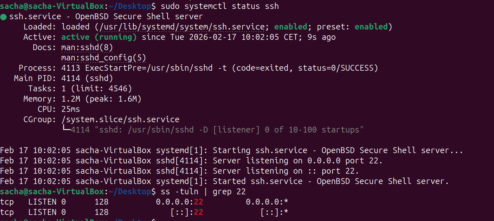

#### 3. Connexion depuis la machine hôte

`ssh sacha@192.168.56.101`

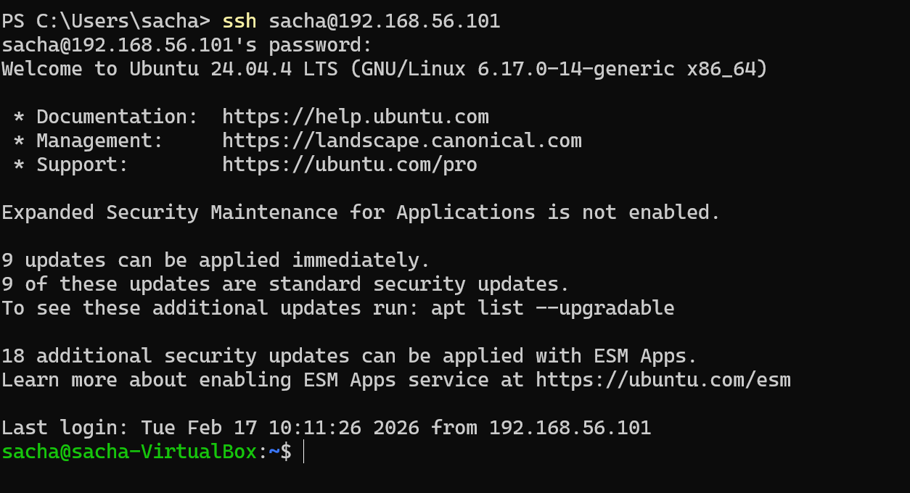

#### 4. Générez une clé SSH sur la machine cliente et copiez-la sur le serveur pour tester la connexion sans mot de passe.

`ssh-keygen`

`type $env:USERPROFILE\.ssh\id_ed25519.pub | ssh sacha@192.168.56.101 "mkdir -p ~/.ssh && cat >> ~/.ssh/authorized_keys && chmod 700 ~/.ssh && chmod 600 ~/.ssh/authorized_keys"`

`ssh sacha@192.168.56.101`
 
plus besoin de mot de passe pour se connecter a ssh connexion via les clé. 

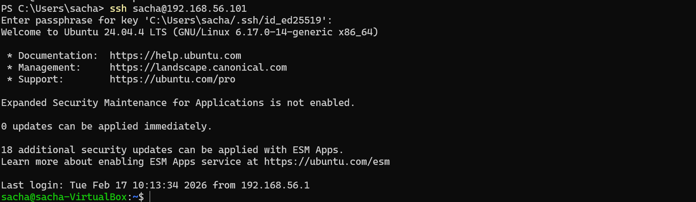

## Partie 3 – Sécurisation SSH

#### Modifiez la configuration SSH sur le serveur pour renforcer la sécurité :

`sudo nano /etc/ssh/sshd_config`

- 1. Interdisez l’accès root.

- 2. Désactivez l’authentification par mot de passe.

- 3. Changez le port par défaut (22) pour réduire les tentatives de brute-force

- 4. Testez la connexion avec le nouveau port depuis la machine cliente.

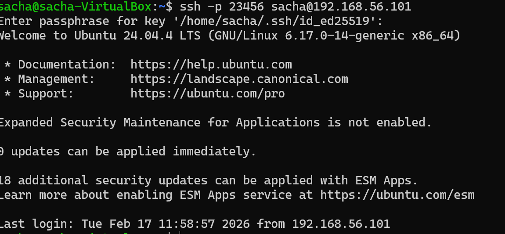

- 5. Créez un alias SSH dans ~/.ssh/config pour simplifier les connexions.

`sudo nano ~/.ssh/config`

`ssh serveur-tp`

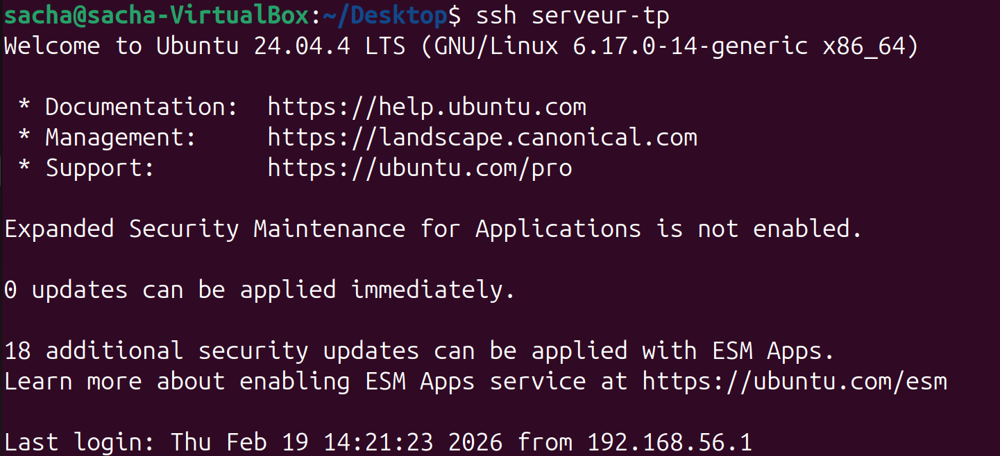

## Partie 4 – Transfert de fichiers

#### Transférez un fichier et un dossier depuis la machine cliente vers le serveur :

- SCP : scp fichier.txt serveur-tp:/home/sacha/

`scp test_windows.txt serveur-tp:/home/sacha/`

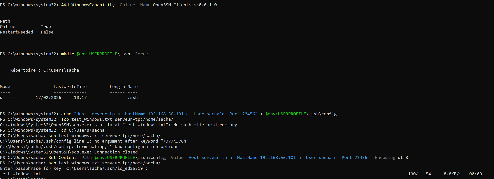

#### SFTP : explorez les commandes put, get, ls pour transférer et naviguer sur le serveur.

- 1. Connexion :`sftp serveur_tp`

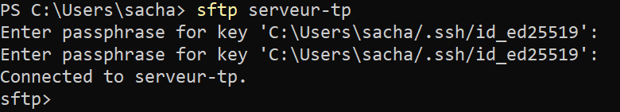

- 2. Lister les fichiers sur la VM :`ls`

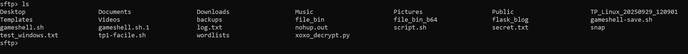

- 3. Lister les fichiers sur ton Windows :`lls`

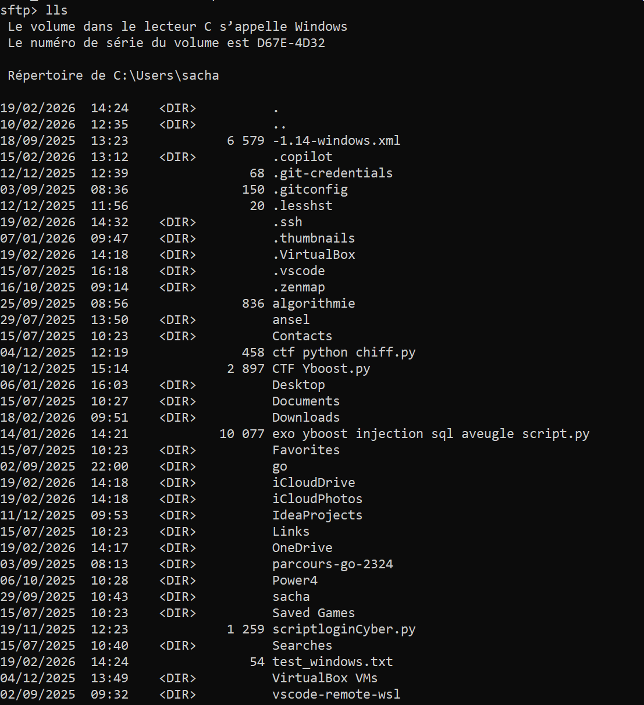

- 4. Envoyer un autre fichier :`put test_windows.txt`

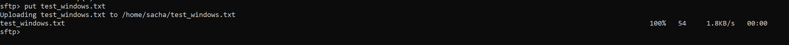

- 5. Récupérer le fichier depuis la VM vers ton Windows :`get test_windows.txt`

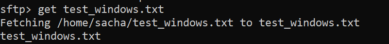

#### RSYNC : synchronisez un dossier entre client et serveur.

- Créer le dossier et les fichiers sur Windows
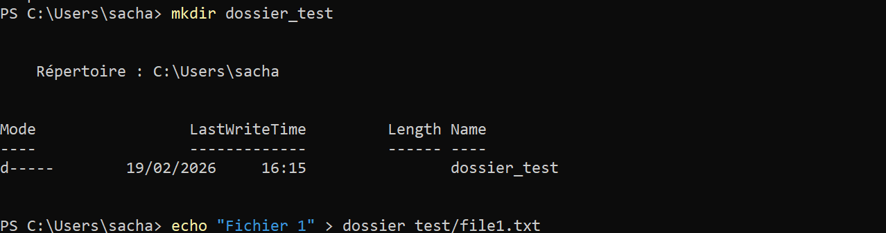

- Transférer le dossier vers la VM

`rsync -avz ./dossier_test/ serveur-tp:/home/sacha/`
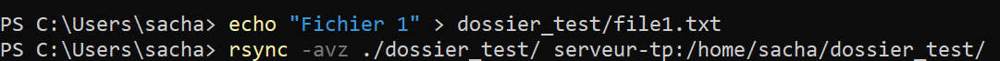

- Vérifier sur la VM
`ls`

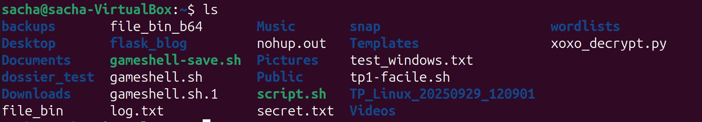

## Partie 5 – Analyse des logs et sécurité

#### 1. Surveiller les logs en temps réel

`1. Surveiller les logs en temps réel`

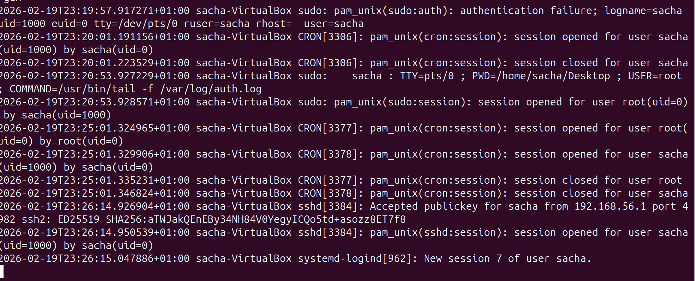

#### Installez Fail2Ban et testez un bannissement après plusieurs tentatives échouées.

`sudo nano /etc/fail2ban/jail.local`

`[sshd]
enabled = true
port = 23456 (mets ton port personnalisé ici)
maxretry = 3
bantime = 600
findtime = 600`

- On essaie de se connecter en SSH mais on se trompe volontairement de mot de passe 3 fois de suite :

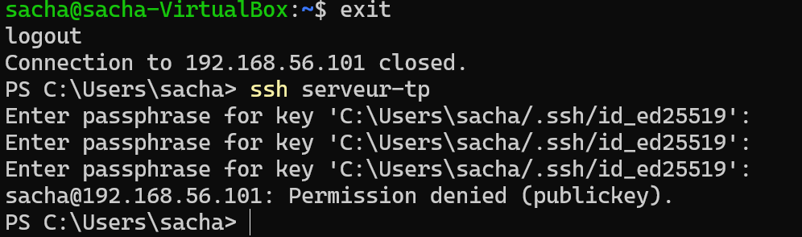

#### Partie 6 – Tunnel SSH
`sudo apt upda te && sudo apt install nginx -y`

- Tunnel Local 

`ssh -L 8081:localhost:8080 serveur-tp`

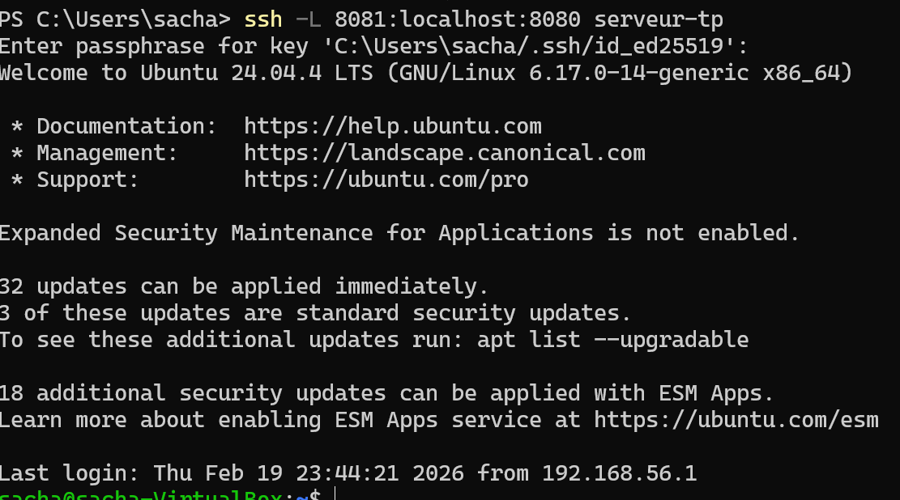

`ssh -R 9090:localhost:22 serveur-tp`

- Tunnel distant

`ssh -R 9090:localhost:22 serveur-tp`

pour virifier que ca marche:

`ssh -p 9090 sacha@localhost`

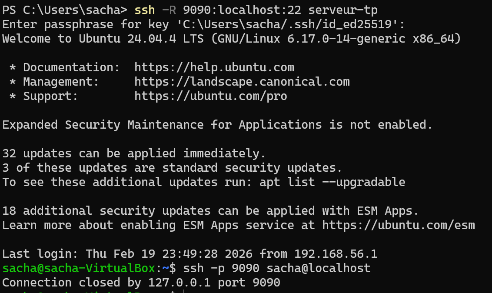

## Partie 7 – Nginx et HTTPS

- Créez un site test dans /var/www/site-tp et un fichier index.html avec un message de bienvenue.

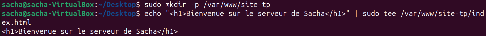

- Générez un certificat auto-signé pour HTTPS et configurez la redirection HTTP → HTTPS.
Piste :

`sudo openssl req -x509 -nodes -days 365 -newkey rsa:2048 -keyout /etc/ssl/private/nginx-selfsigned.key -out /etc/ssl/certs/nginx-selfsigned.crt
`

`curl -k https://192.168.56.101`

## Partie 8 – Firewall et permissions

#### Autorisez Nginx dans le firewall (ports HTTP/HTTPS).

`sudo ufw allow 'Nginx Full'`

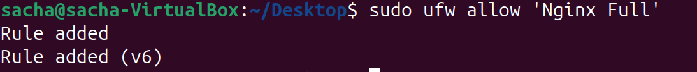

- Vérifier port SSH personnalisé est bien autorisé:

`sudo ufw allow 23456/tcp`

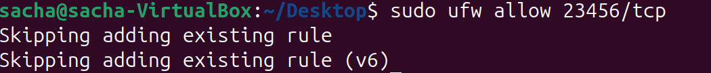

- ON active le firewall:

`sudo ufw enable`

- Vérifier le statut :

`sudo ufw status`

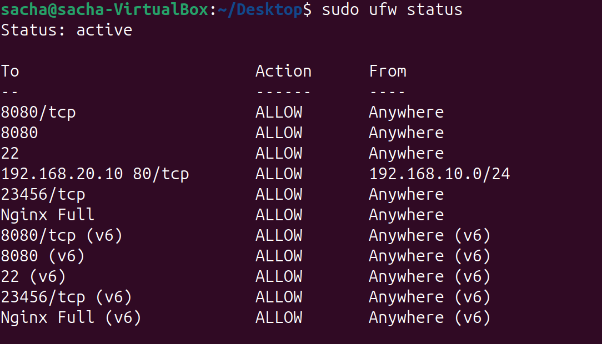

#### Gestion des Permissions

- Définir le propriétaire :

`sudo chown -R www-data:sacha /var/www/site-tp`

- Régler les droits (chmod) :

`sudo chmod -R 755 /var/www/site-tp`

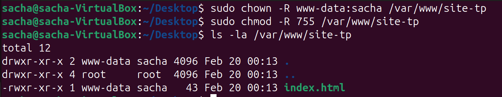

## Partie 9 

#### SSH & Sécurité :

- La connexion se fait uniquement via ta clé SSH (sans mot de passe).

- Le port utilisé est bien le 23456.

- L'accès direct en root est interdit.

#### Fail2Ban :

- Le service est active (running).

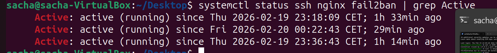

- La prison sshd est active et surveille ton port personnalisé.

#### Serveur Web Nginx :

- Le site est accessible via https://192.168.56.101.

- La redirection automatique du port 80 vers le 443 fonctionne (le test curl -I l'a prouvé).

- Le certificat SSL auto-signé est bien présenté au navigateur.

#### Firewall & Permissions :

- ufw est actif et n'autorise que le nécessaire (Nginx Full et port 23456).

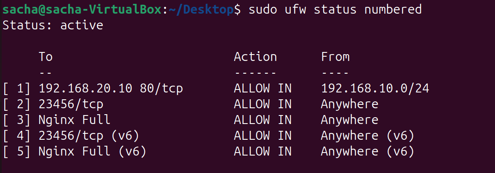

- Le dossier /var/www/site-tp appartient à www-data.

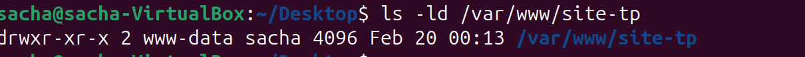